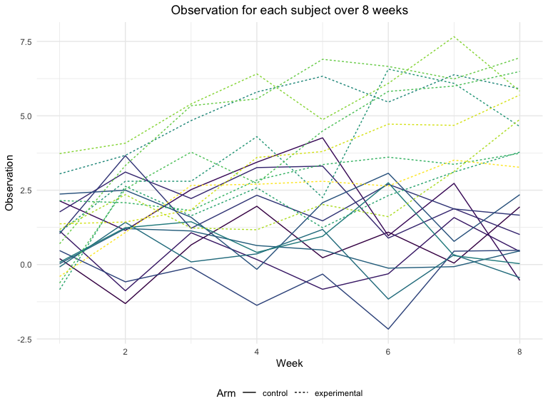
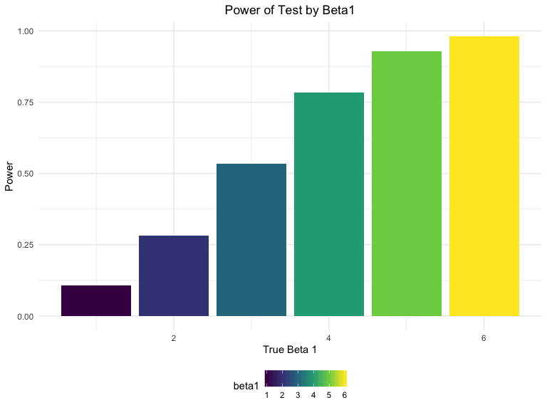
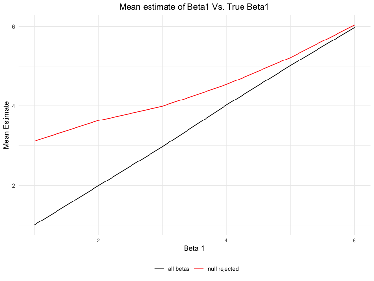

Homework 5 p8105
================
Rebecca Silva
11/08/2019

### Problem 1

``` r
set.seed(10)

iris_with_missing = iris %>% 
  map_df(~replace(.x, sample(1:150, 20), NA)) %>%
  mutate(Species = as.character(Species))

fill_missing = function(vec){
  if(is.numeric(vec)){
    ifelse(is.na(vec), round(mean(vec, na.rm = T), digits = 2), vec)
  }else{
    ifelse(is.na(vec), "virginica", vec)
  }
}

iris_filled = map(iris_with_missing, fill_missing)
is.na(iris_filled)
```

    ## Sepal.Length  Sepal.Width Petal.Length  Petal.Width      Species 
    ##        FALSE        FALSE        FALSE        FALSE        FALSE

### Problem 2

``` r
df = tibble(
  names = list.files("data")
)
tidy_df = 
  df %>% 
  mutate(patient = map(str_c("./data/", names), read.csv)) %>% 
  unnest(cols = c(patient)) %>% 
  separate(names, 
           into = c("arm", "id"), 
           sep = "_") %>% 
  pivot_longer(
    week_1:week_8, 
    names_to = "week", 
    values_to = "value"
  ) %>% 
  mutate(week = as.numeric(str_remove(week, "week_")), 
         id = as.numeric(str_remove(id, ".csv")))
```

``` r
# spaghetti plot 
tidy_df %>% 
  mutate(id_arm = str_c(arm, id, sep = "_")) %>% 
  ggplot(aes( x = week, y = value, color = id_arm)) + 
  geom_line(aes(group = id_arm, linetype = arm)) + 
  labs(
    title = "Observation for each subject over 8 weeks",
    x = "Week",
    y = "Observation") +
  theme(plot.title = element_text(hjust = 0.5), 
        legend.position = "bottom") +
  guides(color = FALSE) +
  scale_linetype_discrete(name = "Arm", labels = c("control", "experimental"))
```



The spaghetti plot shows that over the course of 8 weeks, individual’s
observations in the experimental group increase while individual’s
observations in the control group tend to stay fluctuating around lower
observations and may even decrease.

### Problem 3

``` r
# assigning vars 
n = 30
x = rnorm(n)
beta0 = 2
var = 50 
```

``` r
# function to get data 
generate_data = function( beta1){

  sim_data = tibble(
    y = beta0 + beta1 * x + rnorm(n, sd = sqrt(var))
  )
  
  result  = # extract p-val and est
    lm(y ~ x, data = sim_data) %>% 
    summary() %>% 
    broom::tidy() %>%  
    filter(term == "x") %>% 
    select(estimate, p.value)
}
```

``` r
# beta1 = 0, 10,000 datasets 
beta1_results = 
  rerun(10000, generate_data(beta1 = 0)) 

head(beta1_results, 2)
```

    ## [[1]]
    ## # A tibble: 1 x 2
    ##   estimate p.value
    ##      <dbl>   <dbl>
    ## 1     2.02   0.207
    ## 
    ## [[2]]
    ## # A tibble: 1 x 2
    ##   estimate p.value
    ##      <dbl>   <dbl>
    ## 1     2.17   0.208

``` r
# beta = 1-6
set.seed(1)

sim_results = 
  tibble(beta1 = c(1:6)) %>% 
  mutate(
    output_lists = map(.x = beta1, ~rerun(10000, generate_data(beta1 = .x))),
    estPval = map(output_lists, bind_rows)) %>% 
  select(-output_lists) %>% 
  unnest(estPval)
```

``` r
sim_results %>% 
  mutate( reject = ifelse(p.value < 0.05, TRUE, FALSE)) %>% 
  group_by(beta1) %>% 
  summarise(prop = sum(reject)/n()) %>% 
  ggplot(aes( x = beta1, y = prop, fill = beta1)) + 
  geom_bar(stat = "identity") +
  labs(
    title = "Power of Test by Beta1",
    x = "True Beta 1",
    y = "Power") +
  theme(plot.title = element_text(hjust = 0.5))
```



In the case of simple linear regression, effect size is equivalent to
Beta1. As effect size increases, the probability of rejecting the null
increases since the true beta is getting farther away from the null,
Beta1 = 0. As the true Beta1 gets farther from 0, it is more likely that
our simulated data will find Beta1 is significantly different from 0,
using an alpha level of 0.05.

``` r
data1= sim_results %>% 
  group_by(beta1) %>% 
  summarize(mean = mean(estimate)) %>% 
   cbind(data = rep("data1",nrow(.)))

data2 = sim_results %>% 
  mutate( reject = ifelse(p.value < 0.05, TRUE, FALSE)) %>% 
  group_by(beta1, reject) %>% 
  summarize(mean = mean(estimate)) %>% 
  filter(reject) %>% 
  cbind(data = rep("data2",nrow(.))) %>% 
  select(-reject)

data = bind_rows(data1, data2)

# plot 
ggplot(data, aes( x = beta1, y = mean, color = data)) +
  geom_line() +
  labs(
    title = "Mean estimate of Beta1 Vs. True Beta1",
    x = "Beta 1",
    y = "Mean Estimate") +
  scale_color_manual(values = c("black", "red"), 
                     name = "", 
                     labels = c("all betas", "null rejected")) +
  theme(plot.title = element_text(hjust = 0.5))
```



The sample average of Beta1 across tests for which the null is rejected
is greater than the true value of Beta1. Additionally, the sample
average gets closer to the true beta as beta increases.

This is because we are more likely to reject a test when the estimated
Beta1 is not equal to the true Beta1 value, since we are more likely to
reject a test when the estimated Beta1 is far from 0, the null.
Therefore, for cases when the true beta is closer to 0, the test is only
rejected for estimates of beta far away from the true beta. As the true
Beta1 grows, more tests are rejected (as seen from the above plot), so
the average sample of Beta1 that was rejected grows closer to the true
Beta1.
